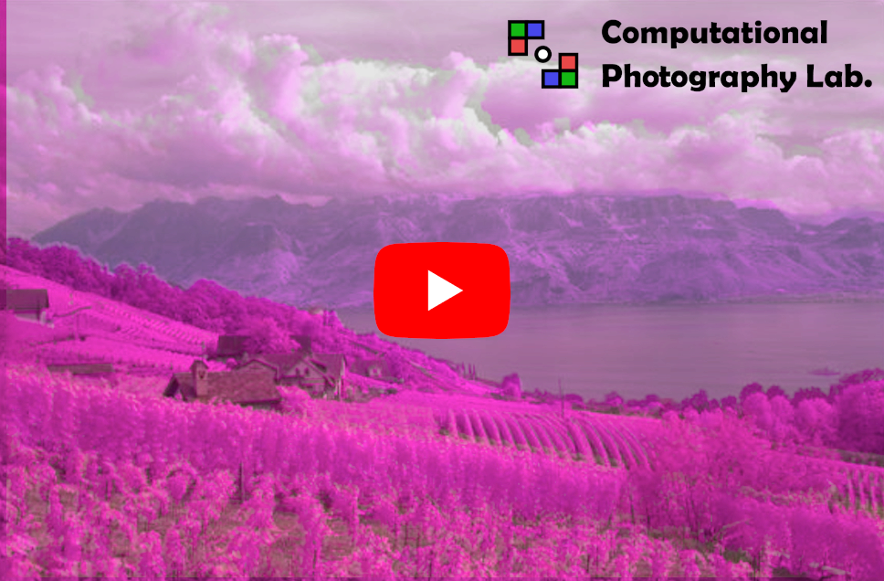

# Introduction + demo video:

  

# Running:

- Requirements: nodejs and react installed.
- After cloning: `npm install`
- To run demo: `npm run dev` and access localhost with the indicated port number at the terminal

# Data:

- Some sample data was provided in the folder /public
- To test additional files -> use the cat's eye pictures (halpha as nir and oiii as additional)

# Credit for the data:

- Images with name "cats-eye-halpha.png", "cats-eye-oiii.png", "cats-eye-rgb.png", "m31_downsampled.png" and "m31_h_downsampled.png" were obtained from the platform [TelescopeLive](https://telescope.live/home)
- Images with name "nir_landscape_aligned.png" and "rgb_landscape_aligned.png" are from the M-SIFT dataset, [[Brown and Süsstrunk 2011]](https://ieeexplore.ieee.org/document/5995637)
- Images with name "rgb_noisy_aligned.png" and "nir_noisy.png" are from the work of [[Krishnan, D., & Fergus, R. (2009)]](https://dl.acm.org/doi/abs/10.1145/1531326.1531402)
